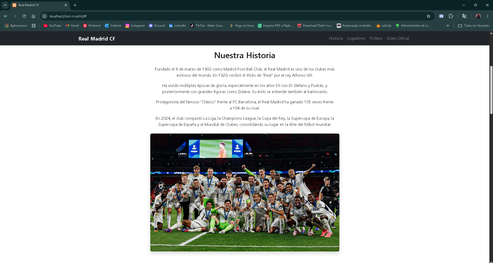
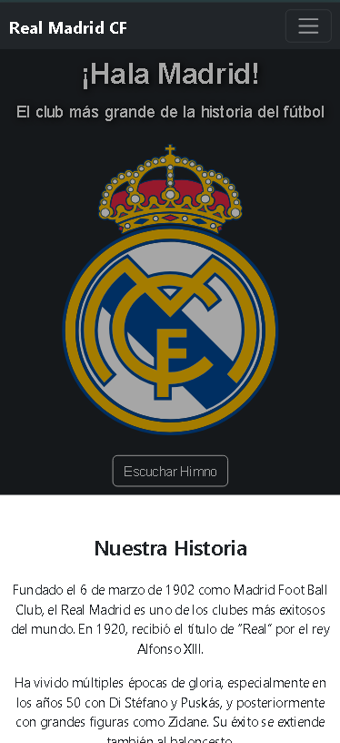

# ⚽ Real Madrid CF - Página Web

Este proyecto es una página web dedicada al club de fútbol **Real Madrid CF**, diseñado con **HTML**, **CSS (personalizado + Bootstrap 5)** y con integración de contenido multimedia (audio, video, e imágenes).

## 🌐 Vista previa



## 🚀 Funcionalidades

- 🔗 Navbar navegable con secciones: Historia, Jugadores, Trofeos, Video
- 🏟 Hero con himno oficial y logo del club
- 📜 Sección de historia del club
- 👥 Jugadores históricos y plantilla actual en carrusel horizontal
- 🏆 Sección de trofeos con íconos animados
- 🎥 Video oficial embebido desde YouTube
- 📅 Próximos partidos en slider animado
- 📱 **Totalmente responsive** para móviles, tablets y escritorio

## 🛠 Tecnologías usadas

- HTML5
- CSS3
- Bootstrap 5
- JavaScript (para el audio y slider)
- Google Fonts (Orbitron)
- Font Awesome (iconos)

## 📁 Estructura de carpetas

```sh
/audio
├── audio.mp3
/css
├── estilo.css
/img
├── estilo.css
/index.html
/README.md
/script.js
```

## 📸 Capturas de pantalla

Puedes agregar capturas de tu página aquí:

| Pantalla completa | Vista móvil |
|-------------------|-------------|
|  |  |

## 👩‍💻 Autor

- **Kimberly Altamirano**  
  🌐 [LinkedIn](https://www.linkedin.com/in/kimberly-altamirano-69163a280/)  

## 📄 Licencia

Este proyecto está bajo la licencia MIT.  
¡Siéntete libre de usarlo, modificarlo y compartirlo!

---

**¡Hala Madrid y nada más!**